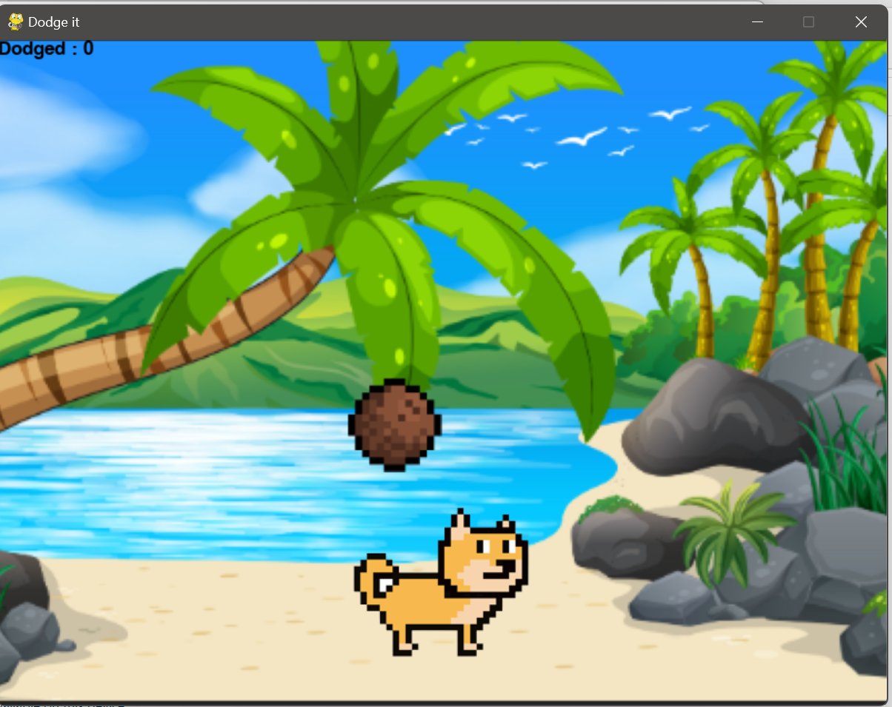
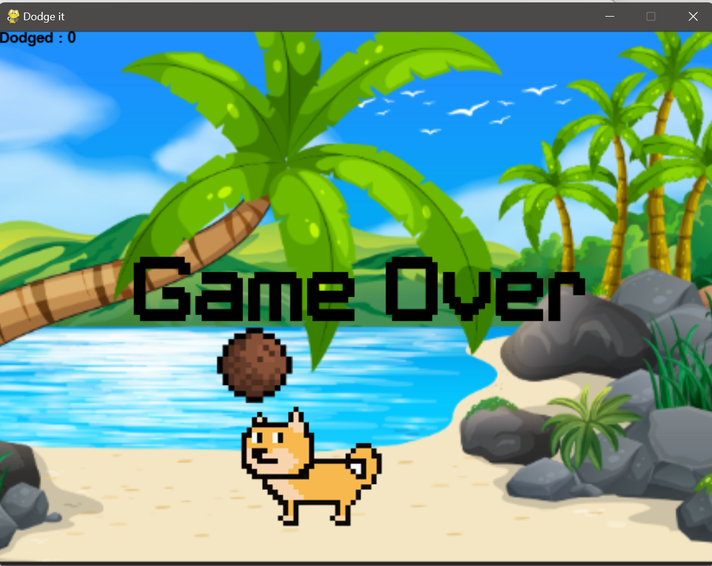

# Dodge-it-game

**Dodge-it-game** is a fun and simple obstacle avoidance game developed in Python using the Pygame module. In this game, you control a cute doge character who is trying to survive by dodging falling coconuts from a tree. Test your reflexes and see how long you can keep the doge safe!

## Gameplay

The objective of the game is straightforward: move the doge character left and right using the arrow keys to avoid falling coconuts. As time passes, the game gets more challenging as the coconuts fall faster. Your score increases with each successfully dodged coconut. The game ends when a coconut hits the doge.

## Features

- Easy-to-understand gameplay mechanics.
- Simple and intuitive controls using the left and right arrow keys.
- Increasing difficulty as time goes on, making the game more challenging.
- Real-time score tracking to challenge yourself and others.
- Cute doge character that players can connect with.

## Installation

1. Make sure you have Python installed on your system, otherwise,<a href="https://www.python.org/downloads/">download here</a>.
2. Clone this repository to your local machine by pasting the below to your cmd:
`git clone https://github.com/Arsha27/Dodge-it-game.git`
3. Navigate to the project directory:
`cd Dodge-it-game`
4. Install the required dependencies using:
`pip install pygame `

## Usage

1. Run the game by executing:
`python pygame1.py`
2. Use the left and right arrow keys to move the doge character and dodge the falling coconuts.
3. Try to survive for as long as possible and achieve the highest score!

Enjoy playing **Dodge-it-game** and have fun dodging those coconuts! If you have any questions or feedback, don't hesitate to get in touch.

